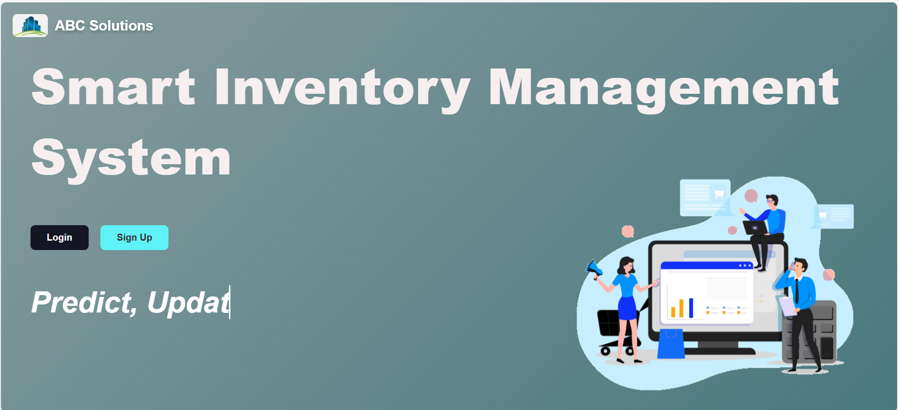
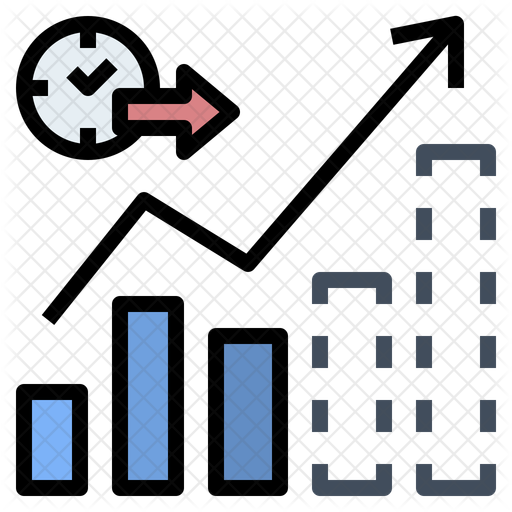

# 📦 Inventory Management & Stock Prediction System

<p align="center">
  
</p>

<h3 align="center">
  Smart Inventory Management with Machine Learning Stock Prediction
</h3>

<p align="center">
  A Flask-based web application for managing inventory, monitoring stock levels, predicting future product demand, and generating automated stock alerts.
</p>

<p align="center">

[](https://www.python.org/)
[](https://flask.palletsprojects.com/)
[](https://scikit-learn.org/)
[](https://www.sqlite.org/)
[](https://powerbi.microsoft.com/)

</p>

---

## 🔗 Project Links

### 📁 GitHub Repository

**Repository:**
https://github.com/cit-23-02-0104-creator/Inventory-management-system

### 📥 Clone Repository

```bash
git clone https://github.com/cit-23-02-0104-creator/Inventory-management-system.git
```

Then:

```bash
cd Inventory-management-system
```

---

# 📌 Project Overview

The **Inventory Management & Stock Prediction System** is a web-based inventory management application developed using **Python, Flask, SQLite, Pandas, Scikit-learn, HTML, CSS and JavaScript**.

The system combines traditional inventory management with **Machine Learning-based stock forecasting** to help users understand current inventory levels and estimate future product demand.

It provides features for:

* User Registration & Login
* Inventory Management
* Stock Monitoring
* Low Stock Detection
* Out-of-Stock Detection
* Machine Learning Stock Prediction
* Manual Future Stock Forecasting
* Sales & Stock Analytics
* Automated Email Alerts
* Daily Stock Reports
* Monthly Stock Forecast Reports
* Power BI Analytics Dashboards
* SQLite Database
* Flask Web Interface
* Cloud Deployment Support

---

# ✨ Main Features

##  1. User Registration & Login

Users can create an account and securely log into the system.

The application uses:

* Flask sessions
* Password hashing
* SQLite database
* Werkzeug security utilities

### Authentication Flow

```text
User
 │
 ├── Sign Up
 │
 ├── Login
 │
 └── Dashboard
```

---

##  2. Inventory Management

Users can manage product stock through the inventory interface.

The system supports:

* Product ID
* Product Name
* Product Category
* Current Stock Quantity
* Stock Updates

Users can increase or decrease stock quantities based on inventory changes.

---

##  3. Low Stock & Out-of-Stock Monitoring

The system automatically checks inventory levels.

### Stock Status

| Stock Level | Status          |
| ----------- | --------------- |
| `0`         | 🚫 Out of Stock |
| `< 25`      | ⚠️ Low Stock    |
| `>= 25`     | ✅ Normal Stock  |

The low-stock threshold is currently configured as:

```python
LOW_STOCK_THRESHOLD = 25
```

---

#  4. Machine Learning Stock Prediction

One of the main features of this project is the **Machine Learning-based stock prediction system**.

The application uses a:

### 🌳 Random Forest Regression Model

The model predicts future product sales using historical sales information.

### Model Features

The model uses:

```text
Lag_1
Lag_2
Lag_3
Lag_6
Year
Month
```

### Target Variable

```text
Units_Sold
```

The model is stored in:

```text
Stock_prediction_model.pkl
```

---

#  5. Manual Stock Prediction

Users can select:

* Product
* Prediction Year
* Prediction Month

The system then predicts future sales and calculates the required additional stock.

### Example

```text
Product
   ↓
Historical Sales
   ↓
Machine Learning Model
   ↓
Predicted Sales
   ↓
Compare With Current Stock
   ↓
Required Stock
```

The prediction result includes:

```text
Product ID
Product Name
Category
Predicted Sales
Current Stock
Required Stock to Add
```

---

#  6. Automated Email Alerts

The application includes automated Gmail-based notification functionality.

The system can send:

###  Low Stock Alerts

When products reach low-stock levels.

###  Out-of-Stock Alerts

When product stock reaches zero.

###  Daily Stock Reports

A daily summary of current inventory.

###  Monthly Stock Forecast

A prediction of the stock required for the upcoming month.

---

#  Automated Scheduler

The project uses the Python `schedule` library for background tasks.

Current scheduled operations include:

```text
Every 30 seconds
      ↓
Low Stock Check
```

```text
Daily
  ↓
End-of-Day Stock Report
```

```text
Daily
  ↓
Monthly Stock Forecast
```

> The exact scheduled times are configured inside `app.py` and can be changed according to deployment requirements.

---

#  7. Analytics Dashboards

The project includes Power BI dashboard files:

```text
Sales analysis.pbix
Stock analysis.pbix
```

These dashboards can be used to analyze:

* Sales performance
* Product performance
* Stock levels
* Inventory trends
* Business insights
* Product demand

> Power BI reports may require appropriate Power BI sharing or embedding permissions before they can be viewed publicly.

---

#  Machine Learning Workflow

The complete ML workflow is:

```text
Historical Sales Data
        │
        ▼
Data Cleaning
        │
        ▼
Monthly Sales Aggregation
        │
        ▼
Feature Engineering
        │
        ├── Lag_1
        ├── Lag_2
        ├── Lag_3
        ├── Lag_6
        ├── Year
        └── Month
        │
        ▼
Train/Test Split
        │
        ▼
Random Forest Regression
        │
        ▼
Stock Prediction Model
        │
        ▼
Future Sales Prediction
        │
        ▼
Required Stock Calculation
```

---

# 🗂️ Project Structure

```text
Inventory-management-system/
│
├── app.py
├── train_model.py
├── test_email.py
├── s.py
│
├── Stock_prediction_model.pkl
│
├── inventory_data.csv
├── supermarket_sales.csv
│
├── requirements.txt
├── Procfile
├── .env.example
├── .gitignore
│
├── templates/
│   ├── Main.html
│   ├── index.html
│   ├── intro.html
│   ├── login.html
│   ├── signup.html
│   ├── add_inventory.html
│   ├── manual_prediction.html
│   ├── dashboards.html
│   └── instructions.html
│
├── static/
│   ├── css/
│   │   └── style.css
│   │
│   └── images/
│       ├── logo.png
│       ├── inventry.jpg
│       ├── behavior.png
│       ├── predict.jpg
│       ├── Predict.png
│       ├── add.png
│       ├── dashboards.jpg
│       ├── Forecast.png
│       └── ...
│
├── Sales analysis.pbix
├── Stock analysis.pbix
│
└── README.md
```

---

# 🛠️ Technologies Used

##  Backend

* Python
* Flask
* SQLite
* Gunicorn

##  Data Processing

* Pandas
* NumPy

##  Machine Learning

* Scikit-learn
* Random Forest Regression
* Joblib

##  Frontend

* HTML5
* CSS3
* JavaScript

##  Email

* Python SMTP
* Gmail SMTP Server

##  Business Intelligence

* Microsoft Power BI

##  Deployment

* Gunicorn
* Procfile
* Environment Variables

---

#  Requirements

Before running the project, make sure you have:

* Python 3.x
* pip
* Git

Check Python:

```bash
python --version
```

Check pip:

```bash
pip --version
```

---

# 🚀 Installation & Setup

## 1️ Clone the Repository

```bash
git clone https://github.com/cit-23-02-0104-creator/Inventory-management-system.git
```

Move into the project directory:

```bash
cd Inventory-management-system
```

---

## 2️ Create a Virtual Environment

### Windows

```powershell
python -m venv .venv
```

Activate:

```powershell
.\.venv\Scripts\Activate.ps1
```

If PowerShell blocks activation, you can use:

```powershell
.\.venv\Scripts\activate
```

### macOS / Linux

```bash
python3 -m venv .venv
```

Activate:

```bash
source .venv/bin/activate
```

---

# 3️ Install Dependencies

Run:

```bash
pip install -r requirements.txt
```

The main dependencies include:

```text
Flask
Werkzeug
Pandas
NumPy
Scikit-learn
Joblib
Python-dateutil
Schedule
Gunicorn
```

---

#  4️ Configure Environment Variables

Create a `.env` file or configure the environment variable:

```text
FLASK_SECRET_KEY=your-long-random-secret-key
```

### Windows PowerShell

```powershell
$env:FLASK_SECRET_KEY="your-long-random-secret-key"
```

### macOS / Linux

```bash
export FLASK_SECRET_KEY="your-long-random-secret-key"
```

> Never upload your real `.env` file or secret keys to GitHub.

---

# ▶️ 5️⃣ Run the Application

Start the Flask application:

```bash
python app.py
```

The application will normally be available at:

```text
http://127.0.0.1:5000
```

Open this in your browser.

---

# ❤️ Health Check

The application also provides a health-check endpoint:

```text
http://127.0.0.1:5000/health
```

This can be useful when deploying the application to a cloud hosting platform.

---

#  Retrain the Machine Learning Model

If you want to train the model again using the included sales dataset:

```bash
python train_model.py
```

The training script uses:

```text
supermarket_sales.csv
```

and generates:

```text
Stock_prediction_model.pkl
```

The model uses:

```text
RandomForestRegressor
```

with:

```text
n_estimators = 100
max_depth = 10
random_state = 42
```

---

#  Gmail Email Configuration

The application contains Gmail notification functionality.

For Gmail SMTP, use:

```text
smtp.gmail.com
Port: 465
SSL: Enabled
```

### ⚠️ Security Recommendation

Do **not** use your normal Gmail account password in a production application.

Use a **Google App Password** where applicable.

Also, never commit real email credentials to GitHub.

---

# 🔒 Security

Please make sure the following files/data are **not committed** to GitHub:

```text
.env
users.db
Real Gmail passwords
Gmail App Passwords
Firebase credentials
Private API keys
Secret keys
```

The project should use environment variables for sensitive configuration.

---

# 🗃️ Data Files

The project includes two main datasets:

### Inventory Dataset

```text
inventory_data.csv
```

Used for:

* Product information
* Product IDs
* Current stock quantities
* Inventory management

### Sales Dataset

```text
supermarket_sales.csv
```

Used for:

* Historical sales
* Monthly sales aggregation
* Machine Learning training
* Stock prediction

---

# 📈 Prediction Example

The system can perform calculations such as:

```text
Current Stock = 40 units

Predicted Future Sales = 75 units

Required Additional Stock
= 75 - 40

= 35 units
```

Therefore:

```text
Required Stock to Add = 35 units
```

This allows inventory managers to make more informed stock decisions.

---

# 🌐 Deployment

The project includes deployment support using:

```text
Gunicorn
Procfile
requirements.txt
Environment Variables
```

The included `Procfile` contains:

```text
web: gunicorn app:app
```

Therefore, compatible hosting platforms can use:

```bash
gunicorn app:app
```

The application also supports configurable hosting through environment variables.

---

# ☁️ Production Configuration

Set:

```text
FLASK_SECRET_KEY=your-secure-secret
```

and configure the application platform to use:

```text
gunicorn app:app
```

Make sure all dependencies from:

```text
requirements.txt
```

are installed during deployment.

---

# 🧪 Testing

The project includes:

```text
test_email.py
```

which can be used for testing email functionality.

Before testing email features in production, make sure Gmail SMTP credentials are correctly configured and protected.

---

# 🎯 Project Objectives

The main objectives of this project are:

1. To simplify inventory management.
2. To monitor product stock levels.
3. To identify low-stock and out-of-stock products.
4. To predict future product demand.
5. To support better stock planning.
6. To reduce the risk of stock shortages.
7. To provide useful sales and inventory analytics.
8. To automate stock-related email notifications.
9. To combine inventory management with Machine Learning.
10. To provide a user-friendly web-based management system.

---

# 🌟 Advantages

### ✅ Better Inventory Control

Users can easily monitor and update inventory.

### ✅ Reduced Stock Shortages

Future demand prediction helps identify products that may require additional stock.

### ✅ Automated Notifications

Users can receive stock-related email alerts.

### ✅ Data-Driven Decisions

Machine Learning and Power BI dashboards provide useful insights.

### ✅ Easy to Use

The Flask web interface provides a simple way to interact with the system.

### ✅ Deployment Ready

The project includes the necessary files for cloud deployment.

---

# 🔮 Future Improvements

Possible future improvements include:

* Mobile-responsive improvements
* Role-based user management
* Two-factor authentication
* Better secret/credential management
* More advanced analytics
* Advanced forecasting algorithms
* Real-time dashboard updates
* Supplier management
* Purchase order management
* Barcode/QR code integration
* Browser notifications
* Cloud database integration
* Deep Learning-based demand forecasting
* REST API integration

---

# 📸 Application Screenshots

The project contains interface images inside:

```text
Images/
```

Some of the available screens/features include:

* Main Dashboard
* Login
* Inventory Management
* Stock Prediction
* Forecasting
* Analytics Dashboard

###  Main Dashboard


### 🔐 Login


### 🤖 Stock Prediction


### 🔮 Stock Forecast



### 📦 Inventory Management


### 📊 Analytics Dashboard


### 📈 Dashboard


### 🧠 System Behavior


---

# 📊 Power BI Reports

Included Power BI files:

```text
Sales analysis.pbix
Stock analysis.pbix
```

These reports can be opened using Microsoft Power BI Desktop.

Official Power BI website:

https://powerbi.microsoft.com/

---

# 🧩 System Architecture

```text
                    ┌──────────────────────┐
                    │       User           │
                    └──────────┬───────────┘
                               │
                               ▼
                    ┌──────────────────────┐
                    │   Flask Web App      │
                    │       app.py         │
                    └──────────┬───────────┘
                               │
             ┌─────────────────┼─────────────────┐
             │                 │                 │
             ▼                 ▼                 ▼
       ┌───────────┐     ┌─────────────┐   ┌─────────────┐
       │  SQLite   │     │ Inventory   │   │ Sales Data  │
       │  Database │     │    Data     │   │    CSV      │
       └───────────┘     └─────────────┘   └──────┬──────┘
                                                  │
                                                  ▼
                                        ┌──────────────────┐
                                        │ Machine Learning │
                                        │ Random Forest    │
                                        └────────┬─────────┘
                                                 │
                                                 ▼
                                        ┌──────────────────┐
                                        │ Stock Prediction │
                                        └──────────────────┘
                                                 │
                          ┌──────────────────────┼─────────────────────┐
                          │                      │                     │
                          ▼                      ▼                     ▼
                    ┌───────────┐        ┌────────────┐        ┌────────────┐
                    │   Email   │        │  Flask UI  │        │  Power BI  │
                    │  Alerts   │        │ Dashboard  │        │ Dashboards │
                    └───────────┘        └────────────┘        └────────────┘
```

---

# 📚 Learning Outcomes

This project demonstrates practical knowledge of:

* Python programming
* Flask web development
* HTML/CSS frontend development
* SQLite database management
* User authentication
* Password hashing
* Data preprocessing
* Pandas data analysis
* Machine Learning
* Random Forest Regression
* Feature engineering
* Time-series lag features
* Email automation
* Background scheduling
* Power BI analytics
* Git & GitHub
* Web application deployment

---

# 👨‍💻 Repository

This project is maintained in GitHub:

**Inventory Management System**

https://github.com/cit-23-02-0104-creator/Inventory-management-system

### Clone Command

```bash
git clone https://github.com/cit-23-02-0104-creator/Inventory-management-system.git
```

---

# ⭐ Support

If you find this project useful, consider giving the repository a ⭐ on GitHub.

**Repository:**
https://github.com/cit-23-02-0104-creator/Inventory-management-system

---

# 📜 License

This project is intended for educational and academic purposes.

Please check the repository for the applicable license and usage terms.

---

<p align="center">
  <b>📦 Inventory Management & Stock Prediction System</b>
  <br>
  Smart Inventory • Machine Learning • Analytics • Automation
</p>
